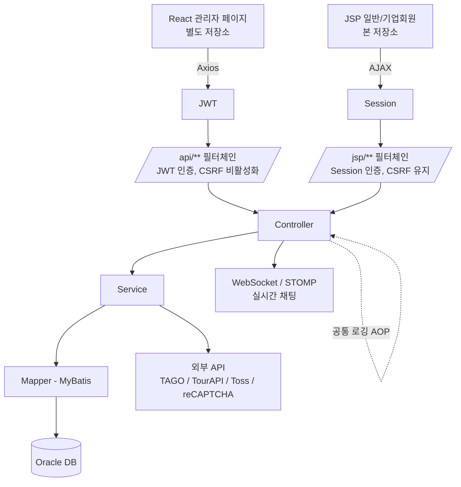

# ✈️ 모행 (Mohaeng)


> AI 기반 개인 맞춤 여행 계획부터 항공권·숙소·투어 예약, 실시간 채팅, 커뮤니티까지 제공하는 여행 통합 플랫폼

이 저장소는 **Backend(Spring/JSP) 저장소**이며, 팀 프로젝트 전체를 소개하는 대표 README를 겸합니다.

모행은 하나의 팀 프로젝트이며, Backend와 React Frontend를 별도의 GitHub Repository에서 관리했습니다.

```text
Backend Repository (현재)
→ Spring / JSP 기반 Backend 및 일반·기업회원 화면

React Repository
→ React 기반 관리자 페이지
```

- React Repository: [MohaengReact](https://github.com/dongkun8130/MohaengReact)

---

## 📖 Description

오프라인·다수 플랫폼에 분산되어 있던 여행 예약 정보(항공권·숙소·투어)와 커뮤니티 기능을 하나의 플랫폼에 통합한 프로젝트입니다. 일반/기업회원은 JSP 기반 화면을, 관리자는 React 기반 화면을 사용하며, 두 클라이언트가 하나의 Spring 백엔드를 공유합니다.

- **기간**: 2025.12.03 ~ 2026.02.03 (9주)
- **팀 구성**: 총 7명으로 구성된 팀 프로젝트로, 모든 팀원이 Frontend와 Backend 개발에 함께 참여했으며 PL, AA, DA, BA, TA 역할을 나누어 협업했습니다. (PL 1 · AA 2 · DA 2 · BA 1 · TA 1)

---

## 🖥️ 주요 화면

<!-- 주요 화면 이미지 추가 -->

### 관리자 페이지
<!-- 관리자 화면 이미지 -->

### 기업회원 예약·리뷰 관리
<!-- 기업회원 화면 이미지 -->

### 항공권 검색 및 예약
<!-- 항공권 화면 이미지 -->

### 로그 조회
<!-- 로그 조회 화면 이미지 -->

---

## ⭐ Main Features

- AI 기반 개인 맞춤형 여행 계획 생성
- 항공권 검색 및 예약 (국토교통부 항공 관련 공공 API 연동)
- 좌석 등급별 실시간 예약 좌석 검증 (매진 항공편 결제 진입 차단)
- 숙소 / 투어 예약
- 실시간 채팅 (WebSocket / STOMP)
- 여행 정보 커뮤니티
- 기업회원 전용 예약내역 · 리뷰관리 화면
- 결제 연동 (토스페이먼츠)

---

## 🔧 Tech Stack

### Backend
- Java 21
- Spring Boot
- Spring Security
- MyBatis

### Frontend
- JSP, JavaScript, jQuery, AJAX, HTML5/CSS3, Bootstrap (일반/기업회원용, 본 저장소)
- React, Axios (관리자용, 별도 저장소)

> **AJAX**: JSP 기반 화면에서 비동기 HTTP 요청을 처리하는 데 사용
> **Axios**: React 관리자 페이지에서 Backend API와 통신하기 위한 HTTP Client

### Database
- Oracle DB

### External API
- 국토교통부에서 제공하는 항공 관련 공공 API (TAGO)
- TourAPI (투어)
- reCAPTCHA
- Toss Payments

### Tools
- Git, GitHub, Redmine

### 기타
- WebSocket (STOMP)
- WAS: Apache Tomcat 10.1

---

## 📂 Project Structure

```text
[실제 Backend Repository 구조 확인 필요]
```

---

## 🔨 Architecture



- `/api/**` : React 관리자 페이지 요청 (Axios로 호출), JWT 인증 필터 적용, CSRF 비활성화
- `/jsp/**` : JSP 일반/기업회원 요청 (AJAX 사용), 기존 세션 인증 및 CSRF 검증 유지
- React 개발 서버(`http://localhost:7272`)는 `@CrossOrigin(allowCredentials = "true")`으로 명시적 허용
- 로그인 성공 시 발급한 JWT를 React 클라이언트의 localStorage에 저장, Axios 인터셉터로 요청 헤더에 자동 첨부하고 401/403 응답 시 토큰 제거 및 재로그인 처리

---

## 🗄️ Database / ERD

항공권 도메인은 3정규화 및 PK/FK 관계 설계, 시퀀스 기반 PK 생성 방식으로 구성했습니다.

- `AIRLINE`, `AIRPORT` : 항공사/공항 기준 정보
- `FLIGHT_PRODUCT` : 항공권 상품 정보 (출/도착 공항, 일정, 좌석 등급, 가격 등)
- `FLIGHT_RESERVATION` : 항공 예약 정보 (예약자, 결제키, 총 결제금액)
- `FLIGHT_PASSENGERS` : 탑승객 정보 (`FLIGHT_RESERVATION`과 1:N)

<!-- ERD 이미지 추가 -->

`[숙소 / 투어 / 커뮤니티 도메인 ERD는 확인 필요]`

---

## 🧩 Technical Challenges

### 1. Spring Security 하이브리드 인증

**문제**: React(JWT)와 JSP(Session)를 같은 애플리케이션에서 사용하는 구조에서 React API 요청 시 403 Forbidden 및 CORS 오류 발생.

**해결**: `@Order`로 `SecurityFilterChain`을 `/api/**`(JWT, CSRF 비활성화)와 `/jsp/**`(Session, CSRF 유지)로 분리하고, `@CrossOrigin`으로 React 개발 서버 Origin을 허용. 로그인 성공 시 발급한 JWT를 localStorage에 저장하고, Axios 인터셉터로 토큰 첨부 및 401/403 시 재로그인 처리.

**결과**: 세션 인증과 토큰 인증이 하나의 애플리케이션 안에서 충돌 없이 동작하도록 필터 체인을 분리했습니다.

### 2. 국토교통부 항공 관련 공공 API 연동

**문제**: 항공 공공 API(TAGO) 호출 시 `serviceKey`가 중복 인코딩되어 인증 실패, 응답 결과 건수에 따라 JSON Object/Array 형식이 달라져 매핑 오류 발생.

**해결**: `DefaultUriBuilderFactory`를 `EncodingMode.NONE`으로 설정해 인코딩 개입을 제거. `ObjectMapper`로 응답을 `JsonNode` 트리로 파싱한 뒤 `isArray()`/`isObject()`로 분기 처리.

**결과**: 중복 인코딩으로 인한 인증 실패를 해결했고, 응답이 Object/Array 어느 형태로 오더라도 처리할 수 있도록 분기 로직을 구현했습니다.

### 3. MyBatis 동적 SQL 조건 누락 (ORA-00933)

**문제**: 관리자 로그 조회 화면에서 카테고리·레벨 필터를 조합할 때 특정 조합에서 `WHERE` 없이 `AND`만 남는 SQL이 생성되어 `ORA-00933` 오류 발생. 목록 조회와 COUNT 서브쿼리의 필터 조건이 어긋나 페이지 수 계산도 실제 데이터와 불일치.

**해결**: p6spy로 조건 조합별 실행 SQL을 확인해 오류가 재현되는 조합을 특정하고, MyBatis `<where>` 태그로 모든 필터 조건을 통일해 감싸는 방식으로 개선. 목록 조회 쿼리와 COUNT 쿼리의 필터 조건을 일치시킴.

**결과**: 카테고리, 레벨, 검색어, 기간 조건을 단독 또는 복합으로 적용해도 SQL 오류 없이 조회되며, 동적 SQL 조건을 일관되게 관리할 수 있도록 구조화했습니다.

### 4. Spring AOP 기반 공통 로깅

**문제**: 여러 Controller/Service에서 요청 처리 로그를 개별적으로 작성해야 하는 상황.

**해결**: Spring AOP로 Controller-Service-Mapper 흐름을 관통하는 공통 로깅 구조를 설계.

**결과**: 공통 로깅 로직을 AOP로 분리해 각 계층의 중복 로그 코드를 줄였습니다.

---

## 💻 Getting Started

`[확인 필요]` — 빌드 도구(Maven/Gradle), 실행 명령어, 포트 설정 등 실제 정보가 확인되지 않았습니다.

확인된 실행 환경:
- JDK 21
- Apache Tomcat 10.1
- Oracle DB

### 환경변수

외부 API 및 데이터베이스 인증 정보는 환경변수로 관리하며, 실제 키 값은 Repository에 포함하지 않습니다.

```properties
spring.datasource.username=${DB_USERNAME}
spring.datasource.password=${DB_PASSWORD}

jwt.secret=${JWT_SECRET}

tago.service-key=${TAGO_SERVICE_KEY}
toss.payment-key=${TOSS_PAYMENT_KEY}
recaptcha.secret-key=${RECAPTCHA_SECRET_KEY}
```

React(관리자) 프로젝트 실행 방법은 [MohaengReact 저장소](https://github.com/dongkun8130/MohaengReact)를 참고하세요.

---

## 👨‍💻 Role & Contribution (신동근)

**역할**: AA(Application Architect) & 보조 DA(Database Architect) & Backend Developer

- Spring Security 하이브리드 인증 구조 설계 (Session + JWT)
- 항공권 검색 기능 및 국토교통부 TAGO API 연동
- 항공권 도메인 DB 설계 (3정규화, PK/FK, 시퀀스 기반 PK)
- 관리자 로그 조회 화면 MyBatis 동적 SQL 오류(ORA-00933) 해결
- 좌석 등급별 실시간 예약 좌석 검증 로직 구현
- Spring AOP 기반 공통 로깅 구조 설계
- 외부 API(TourAPI, reCAPTCHA, 토스페이먼츠) 공통 모듈화
- 기업회원 전용 예약내역·리뷰관리 화면 구현 (Bootstrap 반응형 UI)
- 프로세스 흐름도 및 프로세스 정의서 작성

---

## 👨‍👩‍👧‍👦 Team

총 7명이 참여한 팀 프로젝트이며, 모든 팀원이 Frontend와 Backend 개발에 함께 참여하면서 PL, AA, DA, BA, TA 역할을 나누어 협업했습니다.

| 역할 | 담당자 |
|---|---|
| PL | `[확인 필요]` |
| AA | 신동근 ([dongkun8130](https://github.com/dongkun8130)), `[확인 필요]` |
| DA | 신동근 (보조), `[확인 필요]` |
| BA | `[확인 필요]` |
| TA | `[확인 필요]` |

---

## 📄 License / Contact

- **License**: `[확인 필요]`
- **Contact**: dongkun8130@naver.com
- **GitHub**: [github.com/dongkun8130](https://github.com/dongkun8130)
